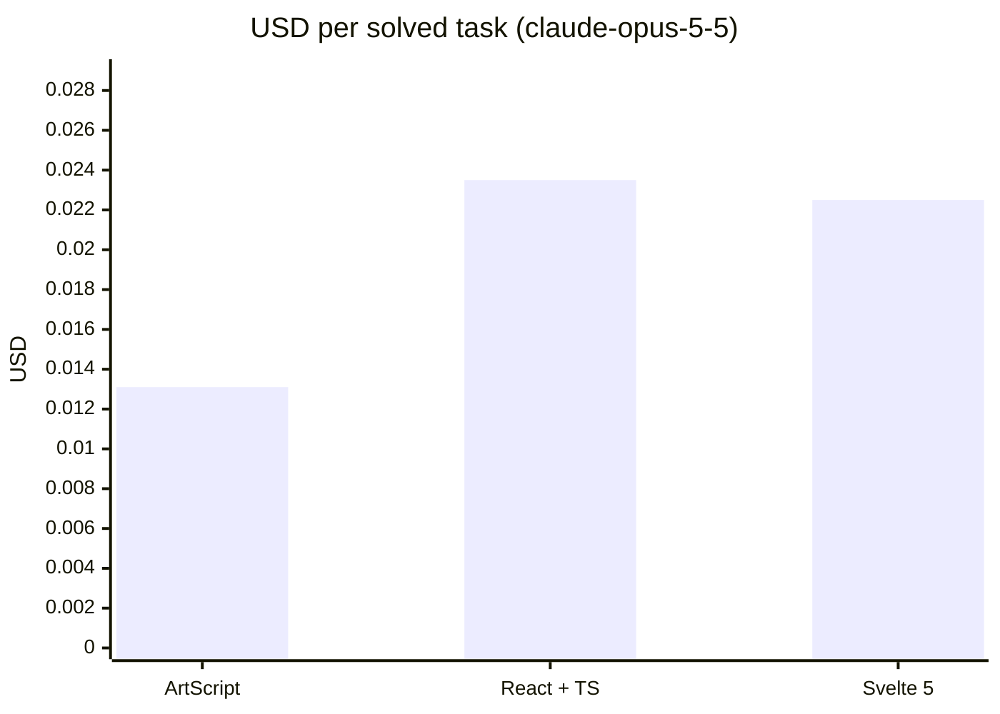
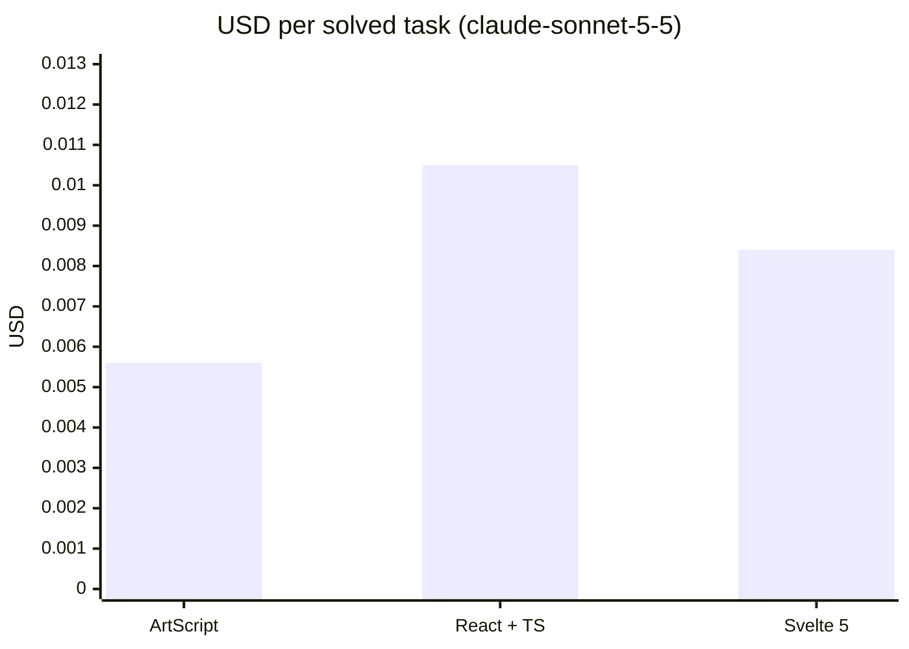

# ArtScript

An AI-native web language that compiles to JavaScript. Goal: let an AI build and modify web apps for **less money** (fewer tokens, less context, fewer retries) than with React/TypeScript.

```
page Counter "/" {
  state count = 0
  computed double = count * 2

  row gap=2 {
    button "-" -> count--
    text count bold
    button "+" primary -> count++
  }
  text `Double is ${double}` muted
}
```

Status: **v0.1, MVP foundation**.

**Early result:** in an agent eval of 8 web tasks (72 runs per model), Claude solved every task in all three stacks, and ArtScript cost **44% less per solved task than React + TypeScript with Claude Opus 5.5, and 47% less with Claude Sonnet 5.5**, counting the spec, retries and thinking tokens. See [Cost eval results](#cost-eval-results).

## Usage

Requires Node 24+.

```sh
npm install
npm run dev            # todo example at http://localhost:3000 (reloads on save)
npm run dev:counter    # counter example
npm run art -- dev examples/users   # full-stack CRUD example (api + data)
npm run art -- dev examples/notes   # accounts, private data and a server fn
npm test               # tests
npm run typecheck      # compiler types
npm run bench          # tokens and bytes vs React/Svelte
```

Create a new project (it comes with `npm run dev`, `npm run build` and `npm run check`):

```sh
node src/cli.ts init my-app
cd my-app && npm install && npm run dev
```

A full-stack CRUD needs one line of backend. `api users: User` serves `/api/users` (list, get, create, update, remove), validated against the model and stored as JSON; `data` loads it and reloads by itself after every write:

```
model User {
  id: ID
  name: String
  email: Email
}

api users: User

page Users {
  data users = api.users.list()
  state name = ""

  input name
  button "Add" -> api.users.create({ name, email: "a@b.co" })
  for u in users {
    text u.name
    button "x" -> api.users.remove(u.id)
  }
}
```

The client is typed end to end: `create` is checked against the model at compile time. `art dev` serves the api; `art build` also emits `dist/server.js` (`node dist/server.js`, no dependencies).

Accounts, per-user data and server logic are one line each:

```
api notes: Note private     // each user only sees and edits their own notes (owner is filled in)
auth users                  // auth.signup / login / logout / me: scrypt-hashed passwords, cookie sessions

server fn stats() {         // runs on the server, called as server.stats()
  if !me {
    fail("Log in first", 401)
  }
  let mine = db.notes.list().filter(n => n.owner == me.id)
  return { total: mine.length }
}
```

Passwords are never returned, and the accounts api only lets each user change or delete their own account.

To change existing code, an AI can send a small `art patch` instead of rewriting files; the whole patch is typechecked and applied atomically:

```
replace Todos/column/title
  title "My tasks"
insert after Todos/column/row
  text "Type and press Enter" muted
set Todos/column gap=6
```

`art context <Component>` lists every addressable path.

Other commands: `npm run art -- <command>` (for example `npm run art -- check examples/todo --ai`). Full list: `npm run art -- help`.

Not published on npm yet (see [docs/PUBLISHING.md](docs/PUBLISHING.md)).

## Layout

```
src/
  lexer.ts      source → tokens
  parser.ts     tokens → AST (Pratt parser for JS expressions)
  ast.ts        AST types (stable, JSON-serializable)
  checker.ts    types, null safety, errors with fixes
  codegen.ts    AST → ES module that builds the DOM directly (no virtual DOM)
  printer.ts    AST → canonical code (fmt, errors, context)
  context.ts    compact context for LLMs
  patch.ts      `art patch`: structured AST edits, atomic and typechecked
  elements.ts   single table of UI primitives
  errors.ts     error catalog and human / AI output formats
  compile.ts    full pipeline
  cli.ts        the `art` command
runtime/runtime.js   signals + DOM helpers + api client (~2.9 KB brotli)
runtime/server.js    api server: REST from models, validation, JSON storage, auth, server fns
examples/            counter, todo, users (full-stack CRUD), notes (auth + private data)
benchmarks/          equivalent tasks in ArtScript / React / Svelte + measurement
docs/SPEC.md         compact spec to give an AI (~1.1K tokens)
templates/default/   starter project created by `art init`
tests/               parser, checker, runtime, e2e (in-memory DOM), tools, docs
```

## First measurements

`npm run bench`, `o200k_base` tokenizer:

| Task | ArtScript | React+TS | Svelte 5 |
|---|---|---|---|
| counter | 92 | 181 | 154 |
| todo | 245 | 471 | 400 |

This only measures **source code size**. It doesn't yet include the spec in context, agent iterations or USD cost, so no real savings can be claimed from it (that's what the agent cost eval below is for). Also, `o200k_base` is OpenAI's tokenizer; Claude's differs.

## Agent cost eval

`benchmarks/eval/` has Claude solve the same 8 tasks (6 create, 2 modify) in ArtScript, React+TS and Svelte, and measures what matters: **USD per solved task**. It counts the spec in context, retries until the code compiles, and thinking tokens.

```sh
npm run eval -- --dry-run                         # validates the harness, spends nothing
echo "ANTHROPIC_API_KEY=sk-ant-..." > .env        # .env is gitignored
npm run eval -- --runs 3 --max-usd 10             # full run (claude-opus-5-5)
npm run eval -- --model claude-sonnet-5-5 --tasks counter,todo
```

Validation: ArtScript with its own compiler, React with strict `tsc`, Svelte with its compiler (no type checking, which favors Svelte). It doesn't check runtime behavior yet, only that the code compiles and typechecks. Results are saved to `benchmarks/eval/results/`.

<!-- eval-results:start -->

## Cost eval results

### claude-opus-5-5 (effort medium)

With `claude-opus-5-5`, ArtScript cost **44% less** per solved task than React + TS and **42% less** than Svelte 5.

| Stack | Solved | USD per solved task | vs React | Without prompt cache | Avg attempts | Output tokens / run | Final code tokens |
|---|---|---|---|---|---|---|---|
| **ArtScript** | 24/24 | **$0.0131** | −44% | $0.0208 | 1.13 | 579 | 382 |
| React + TS | 24/24 | $0.0235 | — | $0.0235 | 1.00 | 1102 | 1026 |
| Svelte 5 | 24/24 | $0.0225 | −4% | $0.0225 | 1.00 | 1049 | 914 |



<details><summary>Per task</summary>

| Task | ArtScript | React + TS | Svelte 5 |
|---|---|---|---|
| counter | $0.0037 (3/3) | $0.0119 (3/3) | $0.0118 (3/3) |
| todo | $0.0287 (3/3) | $0.0299 (3/3) | $0.0270 (3/3) |
| login | $0.0055 (3/3) | $0.0204 (3/3) | $0.0196 (3/3) |
| search | $0.0091 (3/3) | $0.0208 (3/3) | $0.0214 (3/3) |
| cart | $0.0280 (3/3) | $0.0354 (3/3) | $0.0410 (3/3) |
| tabs | $0.0112 (3/3) | $0.0297 (3/3) | $0.0237 (3/3) |
| counter-mod | $0.0070 (3/3) | $0.0157 (3/3) | $0.0176 (3/3) |
| todo-mod | $0.0120 (3/3) | $0.0245 (3/3) | $0.0178 (3/3) |

</details>

Run 2026-09-30: 8 tasks × 3 stacks × 3 runs, total $1.42, prices as of 2026-09-25. Raw data: [`benchmarks/eval/results/2026-09-30T22-23-39-claude-opus-5-5.json`](benchmarks/eval/results/2026-09-30T22-23-39-claude-opus-5-5.json).

### claude-sonnet-5-5 (effort medium)

With `claude-sonnet-5-5`, ArtScript cost **47% less** per solved task than React + TS and **33% less** than Svelte 5.

| Stack | Solved | USD per solved task | vs React | Without prompt cache | Avg attempts | Output tokens / run | Final code tokens |
|---|---|---|---|---|---|---|---|
| **ArtScript** | 24/24 | **$0.0056** | −47% | $0.0099 | 1.13 | 415 | 391 |
| React + TS | 24/24 | $0.0105 | — | $0.0105 | 1.00 | 971 | 896 |
| Svelte 5 | 24/24 | $0.0084 | −20% | $0.0084 | 1.00 | 763 | 797 |



<details><summary>Per task</summary>

| Task | ArtScript | React + TS | Svelte 5 |
|---|---|---|---|
| counter | $0.0057 (3/3) | $0.0053 (3/3) | $0.0043 (3/3) |
| todo | $0.0053 (3/3) | $0.0130 (3/3) | $0.0109 (3/3) |
| login | $0.0032 (3/3) | $0.0097 (3/3) | $0.0083 (3/3) |
| search | $0.0046 (3/3) | $0.0096 (3/3) | $0.0086 (3/3) |
| cart | $0.0098 (3/3) | $0.0155 (3/3) | $0.0169 (3/3) |
| tabs | $0.0038 (3/3) | $0.0098 (3/3) | $0.0085 (3/3) |
| counter-mod | $0.0099 (3/3) | $0.0085 (3/3) | $0.0049 (3/3) |
| todo-mod | $0.0027 (3/3) | $0.0127 (3/3) | $0.0050 (3/3) |

</details>

Run 2026-09-30: 8 tasks × 3 stacks × 3 runs, total $0.59, prices as of 2026-09-25. Raw data: [`benchmarks/eval/results/2026-09-30T22-45-48-claude-sonnet-5-5.json`](benchmarks/eval/results/2026-09-30T22-45-48-claude-sonnet-5-5.json).

### Methodology and limitations

- Each task is the same functional request for every stack (6 create, 2 modify). Claude gets the task, returns files, and the harness validates them: ArtScript with its compiler, React with strict `tsc`, Svelte with its compiler. Errors are fed back, up to 3 attempts.
- In the 2 modify tasks each stack may use its cheapest edit format: ArtScript an `art patch`, React and Svelte search/replace edit blocks (like a coding agent's Edit tool). Full files are also accepted. Runs before 2026-10-01 had no edit formats: every stack returned full files.
- Cost is computed from the real `usage` the API returns: the ArtScript spec in the system prompt, retries and thinking tokens (billed as output) all count.
- ArtScript's system prompt includes its ~1.2K-token spec, which is served from the prompt cache after the first request; the "without prompt cache" column prices those tokens at the full input rate.
- Validation checks that code compiles and typechecks, not runtime behavior. Svelte is validated without TypeScript type checking, which favors it.
- Each run uses the ArtScript spec as of its date; older runs are not redone when the spec improves.
- 3 runs per task is an early signal, not a definitive benchmark. Reproduce it with `npm run eval`.

<!-- eval-results:end -->

## License

MIT
