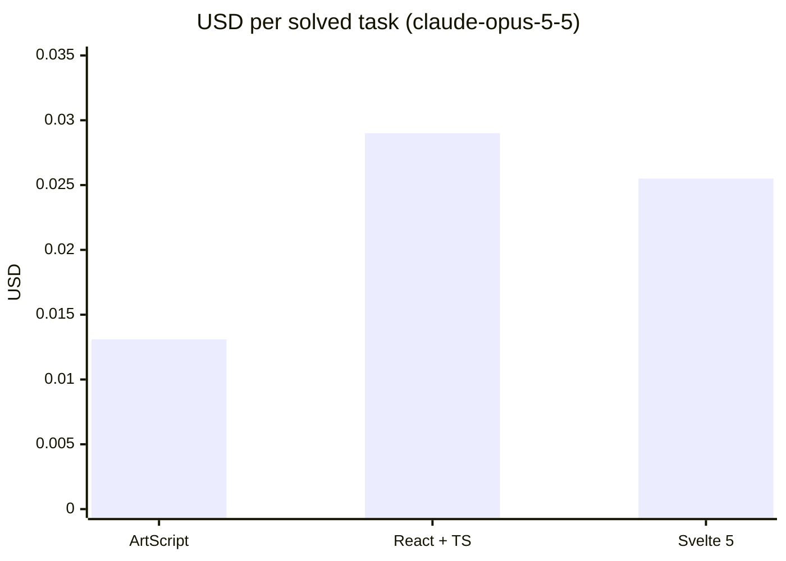
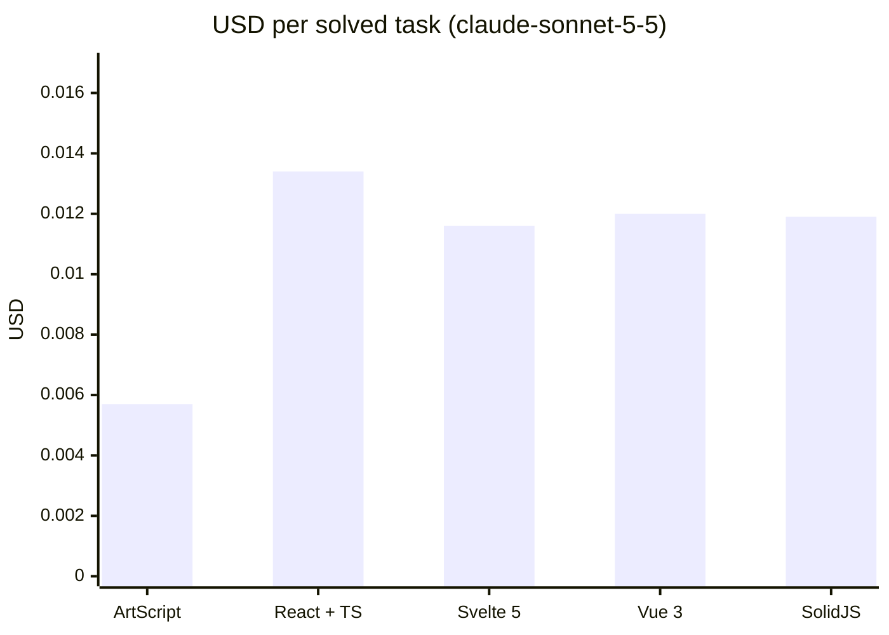
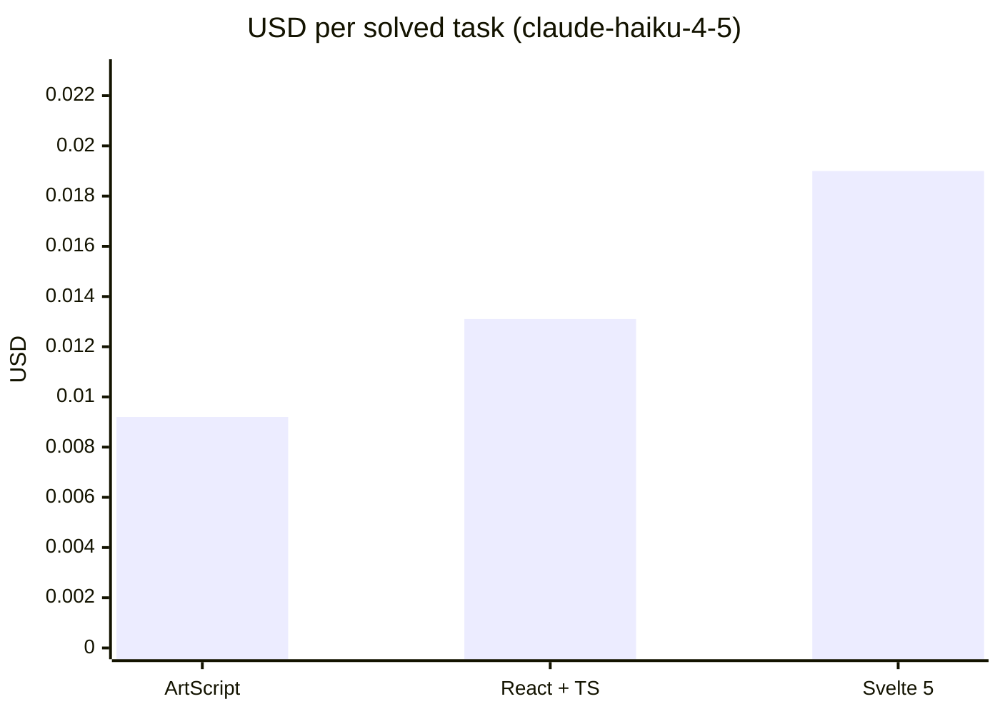

# ArtScript

An AI-native web language that compiles to JavaScript. Goal: let an AI build and modify web apps for **less money** (fewer tokens, less context, fewer retries) than with React/TypeScript.

```
page Counter "/" {
  state count = 0
  computed double = count * 2

  row gap=2 {
    button "-" -> count--
    text count bold
    button "+" primary -> count++
  }
  text `Double is ${double}` muted
}
```

Status: **v0.1, MVP foundation**.

**Early result:** Claude built the same 10 apps (8 frontend, 2 full-stack) in ArtScript, React + TypeScript and Svelte; each app was run and used in a simulated browser to check it works. With Claude Sonnet 5.5 every app worked in all three stacks, and ArtScript cost **57% less per working app than React + TypeScript and 50% less than Svelte** (67% less than React on the full-stack tasks), counting the spec, retries and thinking tokens. Modifying larger existing projects (an 11-component shop and a 42-component admin panel, 64 changes per stack), it cost **49% less than React** (43–57% depending on the project and on whether the whole project or only the relevant parts were in the prompt). Against Vue 3 and SolidJS (also Sonnet 5.5) it cost about 52% less per working app. With the smaller Claude Haiku 4.5 (a partial run, 12 tasks) it cost 29% less than React. The apps it produces ship about 2–3 KB of JavaScript (brotli) versus ~59 KB for React, ~20 KB for Svelte, ~24 KB for Vue and ~6 KB for Solid. An earlier, compile-only run with Claude Opus 5.5 gave 44% less. See [Cost eval results](#cost-eval-results).

## Usage

Requires Node 24+.

```sh
npm install
npm run dev            # todo example at http://localhost:3000 (reloads on save)
npm run dev:counter    # counter example
npm run art -- dev examples/users   # full-stack CRUD example (api + data)
npm run art -- dev examples/notes   # accounts, private data and a server fn
npm run art -- dev examples/catalog # admin role, search, sort and pagination
npm test               # tests
npm run typecheck      # compiler types
npm run bench          # tokens and bytes vs React/Svelte
```

Create a new project (it comes with `npm run dev`, `npm run build` and `npm run check`):

```sh
node src/cli.ts init my-app
cd my-app && npm install && npm run dev
```

A full-stack CRUD needs one line of backend. `api users: User` serves `/api/users` (list, get, create, update, remove), validated against the model and stored as JSON; `data` loads it and reloads by itself after every write:

```
model User {
  id: ID
  name: String
  email: Email
}

api users: User

page Users {
  data users = api.users.list()
  state name = ""

  input name
  button "Add" -> api.users.create({ name, email: "a@b.co" })
  for u in users {
    text u.name
    button "x" -> api.users.remove(u.id)
  }
}
```

The client is typed end to end: `create` is checked against the model at compile time. `art dev` serves the api; `art build` also emits `dist/server.js` (`node dist/server.js`, no dependencies).

Accounts, per-user data and server logic are one line each:

```
api notes: Note private     // each user only sees and edits their own notes (owner is filled in)
auth users                  // auth.signup / login / logout / me: scrypt-hashed passwords, cookie sessions

server fn stats() {         // runs on the server, called as server.stats()
  if !me {
    fail("Log in first", 401)
  }
  let mine = db.notes.list().filter(n => n.owner == me.id)
  return { total: mine.length }
}
```

Passwords are never returned, and the accounts api only lets each user change or delete their own account. `api products: Product admin` lets anyone read and only admins write; the first account becomes the admin and nobody can give themselves a role.

Data lives in SQLite (built into Node, no dependencies), with typed queries:

```
data products = api.products.list({ search, sort: "-price", limit: 20, offset: page * 20 })
data total = api.products.count({ search })
```

Pages have real routes, layouts and client-side navigation (History API):

```
layout Main {
  link "Home" to="/"
  slot
}

page Product "/products/:id" {
  data product = api.products.get(params.id)   // params.id is typed from the route
}

page NotFound "*" {
  title "Not found"
}
```

The UI covers forms and data views out of the box (`select`, `radio`, `tabs`, `checkbox`, `textarea`, `file`, `modal`, `table`, `list`, `badge`, `spinner`, `video`…), plus `on:<event>` handlers, `ref` + `mount`/`effect` with `cleanup` for DOM libraries, component children through `slot`, keyed lists that keep their DOM (`for p in products key p.id`) and responsive props (`grid cols=1 md:cols=3`).

Any npm package or JS/TS module of your own can be used with `use`; the compiler checks that the module and every imported name exist, and `art build` bundles everything into one minified file:

```
use "date-fns" { format }
use "./lib/money.ts" { toUSD }
```

To change existing code, an AI can send a small `art patch` instead of rewriting files; the whole patch is typechecked and applied atomically:

```
replace Todos/column/title
  title "My tasks"
insert after Todos/column/row
  text "Type and press Enter" muted
set Todos/column gap=6
```

`art context <Component>` lists every addressable path. An agent that only changes existing code can load [docs/SPEC-EDIT.md](docs/SPEC-EDIT.md) (~800 tokens) instead of the full [spec](docs/SPEC.md) (~2.9K): the code it reads already shows the syntax.

Other commands: `npm run art -- <command>` (for example `npm run art -- check examples/todo --ai`). Full list: `npm run art -- help`.

Not published on npm yet (see [docs/PUBLISHING.md](docs/PUBLISHING.md)).

## Layout

```
src/
  lexer.ts      source → tokens
  parser.ts     tokens → AST (Pratt parser for JS expressions)
  ast.ts        AST types (stable, JSON-serializable)
  checker.ts    types, null safety, errors with fixes
  codegen.ts    AST → ES module that builds the DOM directly (no virtual DOM)
  printer.ts    AST → canonical code (fmt, errors, context)
  context.ts    compact context for LLMs
  patch.ts      `art patch`: structured AST edits, atomic and typechecked
  elements.ts   single table of UI primitives
  errors.ts     error catalog and human / AI output formats
  compile.ts    full pipeline
  cli.ts        the `art` command
runtime/runtime.js   signals + DOM helpers + api client (~2.9 KB brotli)
runtime/server.js    api server: REST from models, validation, SQLite storage, queries, auth, roles, server fns
examples/            counter, todo, users (full-stack CRUD), notes (auth + private data), catalog (roles, queries), blog (routes, layout)
benchmarks/          equivalent tasks in ArtScript / React / Svelte + measurement
docs/SPEC.md         compact spec to give an AI (~1.1K tokens)
templates/default/   starter project created by `art init`
tests/               parser, checker, runtime, e2e (in-memory DOM), tools, docs
```

## First measurements

`npm run bench`, `o200k_base` tokenizer:

| Task | ArtScript | React+TS | Svelte 5 |
|---|---|---|---|
| counter | 92 | 181 | 154 |
| todo | 245 | 471 | 400 |

This only measures **source code size**. It doesn't yet include the spec in context, agent iterations or USD cost, so no real savings can be claimed from it (that's what the agent cost eval below is for). Also, `o200k_base` is OpenAI's tokenizer; Claude's differs.

## Agent cost eval

`benchmarks/eval/` has Claude solve the same 8 tasks (6 create, 2 modify) in ArtScript, React+TS and Svelte, and measures what matters: **USD per solved task**. It counts the spec in context, retries until the code compiles, and thinking tokens.

```sh
npm run eval -- --dry-run                         # validates the harness, spends nothing
echo "ANTHROPIC_API_KEY=sk-ant-..." > .env        # .env is gitignored
npm run eval -- --runs 3 --max-usd 10             # full run (claude-opus-5-5)
npm run eval -- --model claude-sonnet-5-5 --tasks counter,todo
```

Validation: ArtScript with its own compiler, React with strict `tsc`, Svelte with its compiler (no type checking, which favors Svelte). It doesn't check runtime behavior yet, only that the code compiles and typechecks. Results are saved to `benchmarks/eval/results/`.

<!-- eval-results:start -->

## Cost eval results

### claude-opus-5-5 (effort medium)

With `claude-opus-5-5`, ArtScript cost **55% less** per solved task than React + TS and **49% less** than Svelte 5.

| Stack | Solved | USD per solved task | vs React | Without prompt cache | Avg attempts | Output tokens / run | Final code tokens | App JS (brotli) |
|---|---|---|---|---|---|---|---|---|
| **ArtScript** | 20/20 | **$0.0131** | −55% | $0.0259 | 1.00 | 485 | 395 | 3.2 KB |
| React + TS | 20/20 | $0.0290 | — | $0.0290 | 1.00 | 1367 | 1297 | 58.7 KB |
| Svelte 5 | 20/20 | $0.0255 | −12% | $0.0255 | 1.00 | 1191 | 1117 | 18.2 KB |



<details><summary>Per task</summary>

| Task | ArtScript | React + TS | Svelte 5 |
|---|---|---|---|
| counter | $0.0227 (2/2) | $0.0122 (2/2) | $0.0131 (2/2) |
| todo | $0.0175 (2/2) | $0.0292 (2/2) | $0.0247 (2/2) |
| login | $0.0065 (2/2) | $0.0189 (2/2) | $0.0184 (2/2) |
| search | $0.0101 (2/2) | $0.0203 (2/2) | $0.0213 (2/2) |
| cart | $0.0254 (2/2) | $0.0399 (2/2) | $0.0402 (2/2) |
| tabs | $0.0087 (2/2) | $0.0294 (2/2) | $0.0214 (2/2) |
| counter-mod | $0.0046 (2/2) | $0.0183 (2/2) | $0.0109 (2/2) |
| todo-mod | $0.0112 (2/2) | $0.0247 (2/2) | $0.0179 (2/2) |
| fs-users | $0.0136 (2/2) | $0.0420 (2/2) | $0.0443 (2/2) |
| fs-shopping | $0.0103 (2/2) | $0.0550 (2/2) | $0.0427 (2/2) |

</details>

#### Larger project: 4 modifications to an 11-component shop

Whole project in the prompt ("full") vs. what a good agent would read ("focus": ArtScript gets `art context` of the relevant parts, React/Svelte the file list plus the relevant files). Each change is applied to the whole project and the app is used in the simulated browser.

| Stack | USD per solved task, full | USD per solved task, focus | Input tokens/run, full | Input tokens/run, focus | App JS (brotli) |
|---|---|---|---|---|---|
| **ArtScript** | $0.0218 (8/8) | $0.0132 (8/8) | 5390 | 4638 | 4.1 KB |
| React + TS | $0.0263 (8/8) | $0.0198 (8/8) | 2784 | 1084 | 59.2 KB |
| Svelte 5 | $0.0287 (8/8) | $0.0177 (8/8) | 3222 | 1086 | 20.4 KB |

Input tokens include ArtScript's spec in the system prompt (~1.9K tokens in the 2026-09-30 runs, ~2.7K from 2026-10-01 17:00 on, after routes and the 0.3 UI; mostly billed at the cache rate) and every retry.

#### Larger project: 4 modifications to a 42-component admin panel

Whole project in the prompt ("full") vs. what a good agent would read ("focus": ArtScript gets `art context` of the relevant parts, React/Svelte the file list plus the relevant files). Each change is applied to the whole project and the app is used in the simulated browser.

| Stack | USD per solved task, full | USD per solved task, focus | Input tokens/run, full | Input tokens/run, focus | App JS (brotli) |
|---|---|---|---|---|---|
| **ArtScript** | $0.0340 (8/8) | $0.0159 (8/8) | 9365 | 4940 | 4.3 KB |
| React + TS | $0.0487 (8/8) | $0.0176 (8/8) | 9534 | 1429 | 59.6 KB |
| Svelte 5 | $0.0456 (8/8) | $0.0164 (8/8) | 8898 | 1421 | 20.3 KB |

Input tokens include ArtScript's spec in the system prompt (~1.9K tokens in the 2026-09-30 runs, ~2.7K from 2026-10-01 17:00 on, after routes and the 0.3 UI; mostly billed at the cache rate) and every retry.

Run 2026-09-30: 10 tasks × 3 stacks × 3 runs, total $1.35, prices as of 2026-09-25. 24 cell(s) re-run in 2026-10-01T18-02-02-claude-opus-5-5.json (full Opus run (26 tasks), with the spec that includes routes and the 0.3 UI elements (~2,700 tokens) and `art patch` before the path-tolerance change); 8 cell(s) re-run in 2026-10-01T18-27-21-claude-opus-5-5.json (ArtScript only, admin tasks, after accepting what models write out of habit (see the 2026-10-01 commits: writable computed, two-way props, typed/default params, art patch variants, set Component prop: Type). The two first runs paid the one-time cache write of the new spec, which the full run had charged to its first task). Raw data: [`benchmarks/eval/results/2026-09-30T22-23-39-claude-opus-5-5.json`](benchmarks/eval/results/2026-09-30T22-23-39-claude-opus-5-5.json), [`benchmarks/eval/results/2026-10-01T18-02-02-claude-opus-5-5.json`](benchmarks/eval/results/2026-10-01T18-02-02-claude-opus-5-5.json), [`benchmarks/eval/results/2026-10-01T18-27-21-claude-opus-5-5.json`](benchmarks/eval/results/2026-10-01T18-27-21-claude-opus-5-5.json).

### claude-sonnet-5-5 (effort medium)

With `claude-sonnet-5-5`, ArtScript cost **57% less** per solved task than React + TS and **50% less** than Svelte 5.

| Stack | Solved | USD per solved task | vs React | Without prompt cache | Avg attempts | Output tokens / run | Final code tokens | App JS (brotli) |
|---|---|---|---|---|---|---|---|---|
| **ArtScript** | 20/20 | **$0.0057** | −57% | $0.0097 | 1.00 | 343 | 377 | 1.9 KB |
| React + TS | 20/20 | $0.0134 | — | $0.0134 | 1.00 | 1255 | 1210 | 58.7 KB |
| Svelte 5 | 20/20 | $0.0116 | −14% | $0.0116 | 1.00 | 1072 | 1092 | 18.2 KB |
| Vue 3 | 20/20 | $0.0120 | −10% | $0.0120 | 1.00 | 1117 | 1118 | 23.5 KB |
| SolidJS | 20/20 | $0.0119 | −11% | $0.0119 | 1.00 | 1105 | 1145 | 5.6 KB |



<details><summary>Per task</summary>

| Task | ArtScript | React + TS | Svelte 5 | Vue 3 | SolidJS |
|---|---|---|---|---|---|
| counter | $0.0022 (2/2) | $0.0055 (2/2) | $0.0043 (2/2) | $0.0054 (2/2) | $0.0052 (2/2) |
| todo | $0.0054 (2/2) | $0.0132 (2/2) | $0.0113 (2/2) | $0.0124 (2/2) | $0.0128 (2/2) |
| login | $0.0102 (2/2) | $0.0098 (2/2) | $0.0098 (2/2) | $0.0086 (2/2) | $0.0095 (2/2) |
| search | $0.0041 (2/2) | $0.0095 (2/2) | $0.0087 (2/2) | $0.0102 (2/2) | $0.0091 (2/2) |
| cart | $0.0096 (2/2) | $0.0159 (2/2) | $0.0173 (2/2) | $0.0182 (2/2) | $0.0153 (2/2) |
| tabs | $0.0038 (2/2) | $0.0114 (2/2) | $0.0078 (2/2) | $0.0080 (2/2) | $0.0094 (2/2) |
| counter-mod | $0.0029 (2/2) | $0.0077 (2/2) | $0.0050 (2/2) | $0.0056 (2/2) | $0.0061 (2/2) |
| todo-mod | $0.0027 (2/2) | $0.0115 (2/2) | $0.0050 (2/2) | $0.0076 (2/2) | $0.0055 (2/2) |
| fs-users | $0.0050 (2/2) | $0.0235 (2/2) | $0.0218 (2/2) | $0.0207 (2/2) | $0.0215 (2/2) |
| fs-shopping | $0.0114 (2/2) | $0.0259 (2/2) | $0.0245 (2/2) | $0.0237 (2/2) | $0.0250 (2/2) |

</details>

#### Larger project: 4 modifications to an 11-component shop

Whole project in the prompt ("full") vs. what a good agent would read ("focus": ArtScript gets `art context` of the relevant parts, React/Svelte the file list plus the relevant files). Each change is applied to the whole project and the app is used in the simulated browser.

| Stack | USD per solved task, full | USD per solved task, focus | Input tokens/run, full | Input tokens/run, focus | App JS (brotli) |
|---|---|---|---|---|---|
| **ArtScript** | $0.0093 (8/8) | $0.0051 (8/8) | 4311 | 3559 | 2.6 KB |
| React + TS | $0.0163 (8/8) | $0.0119 (8/8) | 3378 | 1430 | 59.2 KB |
| Svelte 5 | $0.0128 (8/8) | $0.0097 (8/8) | 2731 | 1086 | 20.4 KB |
| Vue 3 | $0.0110 (8/8) | $0.0085 (8/8) | 2879 | 1109 | 24.8 KB |
| SolidJS | $0.0190 (8/8) | $0.0102 (8/8) | 4165 | 1132 | 6.3 KB |

Input tokens include ArtScript's spec in the system prompt (~1.9K tokens in the 2026-09-30 runs, ~2.7K from 2026-10-01 17:00 on, after routes and the 0.3 UI; mostly billed at the cache rate) and every retry.

#### Larger project: 4 modifications to a 42-component admin panel

Whole project in the prompt ("full") vs. what a good agent would read ("focus": ArtScript gets `art context` of the relevant parts, React/Svelte the file list plus the relevant files). Each change is applied to the whole project and the app is used in the simulated browser.

| Stack | USD per solved task, full | USD per solved task, focus | Input tokens/run, full | Input tokens/run, focus | App JS (brotli) |
|---|---|---|---|---|---|
| **ArtScript** | $0.0128 (8/8) | $0.0041 (8/8) | 8180 | 3755 | 2.8 KB |
| React + TS | $0.0246 (8/8) | $0.0086 (8/8) | 9534 | 1429 | 59.6 KB |
| Svelte 5 | $0.0228 (8/8) | $0.0081 (8/8) | 8898 | 1421 | 20.3 KB |
| Vue 3 | $0.0238 (8/8) | $0.0083 (8/8) | 9330 | 1405 | 24.8 KB |
| SolidJS | $0.0261 (8/8) | $0.0091 (8/8) | 10254 | 1486 | 6.8 KB |

Input tokens include ArtScript's spec in the system prompt (~1.9K tokens in the 2026-09-30 runs, ~2.7K from 2026-10-01 17:00 on, after routes and the 0.3 UI; mostly billed at the cache rate) and every retry.

#### Larger project: 4 modifications to a 102-component admin panel

Whole project in the prompt ("full") vs. what a good agent would read ("focus": ArtScript gets `art context` of the relevant parts, React/Svelte the file list plus the relevant files). Each change is applied to the whole project and the app is used in the simulated browser.

| Stack | USD per solved task, full | USD per solved task, focus | Input tokens/run, full | Input tokens/run, focus | App JS (brotli) |
|---|---|---|---|---|---|
| **ArtScript** | $0.0307 (8/8) | $0.0053 (8/8) | 15874 | 4432 | 3.6 KB |
| React + TS | $0.0506 (8/8) | $0.0099 (8/8) | 22654 | 2110 | 60.9 KB |
| Svelte 5 | $0.0470 (8/8) | $0.0095 (8/8) | 21052 | 2102 | 21.4 KB |
| Vue 3 | $0.0493 (8/8) | $0.0095 (8/8) | 22084 | 2026 | 26.0 KB |
| SolidJS | $0.0546 (8/8) | $0.0103 (8/8) | 24364 | 2167 | 7.8 KB |

Input tokens include ArtScript's spec in the system prompt (~1.9K tokens in the 2026-09-30 runs, ~2.7K from 2026-10-01 17:00 on, after routes and the 0.3 UI; mostly billed at the cache rate) and every retry.

Run 2026-10-01: 10 tasks × 5 stacks × 2 runs, total $1.09, prices as of 2026-09-25. 2 cell(s) re-run in 2026-10-01T09-58-38-claude-sonnet-5-5.json (the model's first answers there were correct; the failures came from eval-harness bugs, since fixed); 1 cell(s) re-run in 2026-10-01T09-58-42-claude-sonnet-5-5.json (the model's first answers there were correct; the failures came from an ArtScript compiler bug, since fixed); 16 cell(s) re-run in 2026-10-01T13-25-56-claude-sonnet-5-5.json (ArtScript only, after improving `art patch` and the checker with what the previous run showed; React and Svelte are unchanged); 2026-10-01T13-33-05-claude-sonnet-5-5.json: the 102-component admin panel (xl-* tasks); 2026-10-01T13-46-28-claude-sonnet-5-5.json: Vue 3 and SolidJS added; their xl-required task ran later (see below); 1 cell(s) re-run in 2026-10-01T17-55-58-claude-sonnet-5-5.json (the xl-required task for Vue 3 and SolidJS, which could not run before for lack of credit). Raw data: [`benchmarks/eval/results/2026-10-01T08-29-33-claude-sonnet-5-5.json`](benchmarks/eval/results/2026-10-01T08-29-33-claude-sonnet-5-5.json), [`benchmarks/eval/results/2026-10-01T09-58-38-claude-sonnet-5-5.json`](benchmarks/eval/results/2026-10-01T09-58-38-claude-sonnet-5-5.json), [`benchmarks/eval/results/2026-10-01T09-58-42-claude-sonnet-5-5.json`](benchmarks/eval/results/2026-10-01T09-58-42-claude-sonnet-5-5.json), [`benchmarks/eval/results/2026-10-01T13-23-38-claude-sonnet-5-5.json`](benchmarks/eval/results/2026-10-01T13-23-38-claude-sonnet-5-5.json), [`benchmarks/eval/results/2026-10-01T13-25-56-claude-sonnet-5-5.json`](benchmarks/eval/results/2026-10-01T13-25-56-claude-sonnet-5-5.json), [`benchmarks/eval/results/2026-10-01T13-33-05-claude-sonnet-5-5.json`](benchmarks/eval/results/2026-10-01T13-33-05-claude-sonnet-5-5.json), [`benchmarks/eval/results/2026-10-01T13-46-28-claude-sonnet-5-5.json`](benchmarks/eval/results/2026-10-01T13-46-28-claude-sonnet-5-5.json), [`benchmarks/eval/results/2026-10-01T17-55-58-claude-sonnet-5-5.json`](benchmarks/eval/results/2026-10-01T17-55-58-claude-sonnet-5-5.json).

### claude-haiku-4-5 (no effort setting)

With `claude-haiku-4-5`, ArtScript cost **29% less** per solved task than React + TS and **51% less** than Svelte 5.

| Stack | Solved | USD per solved task | vs React | Without prompt cache | Avg attempts | Output tokens / run | Final code tokens | App JS (brotli) |
|---|---|---|---|---|---|---|---|---|
| **ArtScript** | 17/20 | **$0.0092** | −29% | $0.0092 | 1.80 | 629 | 329 | 2.0 KB |
| React + TS | 18/20 | $0.0131 | — | $0.0131 | 1.50 | 2001 | 1145 | 58.7 KB |
| Svelte 5 | 16/20 | $0.0190 | +45% | $0.0190 | 1.85 | 2540 | 1019 | 17.8 KB |



<details><summary>Per task</summary>

| Task | ArtScript | React + TS | Svelte 5 |
|---|---|---|---|
| counter | $0.0030 (2/2) | $0.0024 (2/2) | $0.0065 (2/2) |
| todo | $0.0225 (1/2) | ✗ (0/2) | ✗ (0/2) |
| login | $0.0033 (2/2) | $0.0045 (2/2) | $0.0140 (2/2) |
| search | $0.0195 (1/2) | $0.0040 (2/2) | $0.0065 (2/2) |
| cart | $0.0353 (1/2) | $0.0129 (2/2) | $0.0247 (2/2) |
| tabs | $0.0090 (2/2) | $0.0032 (2/2) | $0.0046 (2/2) |
| counter-mod | $0.0075 (2/2) | $0.0021 (2/2) | $0.0024 (2/2) |
| todo-mod | $0.0030 (2/2) | $0.0029 (2/2) | $0.0022 (2/2) |
| fs-users | $0.0046 (2/2) | $0.0438 (2/2) | $0.0571 (1/2) |
| fs-shopping | $0.0095 (2/2) | $0.0186 (2/2) | $0.0782 (1/2) |

</details>

#### Larger project: 4 modifications to an 11-component shop

Whole project in the prompt ("full") vs. what a good agent would read ("focus": ArtScript gets `art context` of the relevant parts, React/Svelte the file list plus the relevant files). Each change is applied to the whole project and the app is used in the simulated browser.

| Stack | USD per solved task, full | USD per solved task, focus | Input tokens/run, full | Input tokens/run, focus | App JS (brotli) |
|---|---|---|---|---|---|
| **ArtScript** | $0.0033 (8/8) | $0.0028 (8/8) | 2513 | 2078 | 3.7 KB |
| React + TS | $0.0060 (8/8) | $0.0067 (7/8) | 2603 | 1404 | 59.1 KB |
| Svelte 5 | $0.0057 (8/8) | $0.0037 (8/8) | 2817 | 957 | 20.4 KB |

Input tokens include ArtScript's spec in the system prompt (~1.9K tokens in the 2026-09-30 runs, ~2.7K from 2026-10-01 17:00 on, after routes and the 0.3 UI; mostly billed at the cache rate) and every retry.

#### Larger project: 4 modifications to a 42-component admin panel

Whole project in the prompt ("full") vs. what a good agent would read ("focus": ArtScript gets `art context` of the relevant parts, React/Svelte the file list plus the relevant files). Each change is applied to the whole project and the app is used in the simulated browser.

| Stack | USD per solved task, full | USD per solved task, focus | Input tokens/run, full | Input tokens/run, focus | App JS (brotli) |
|---|---|---|---|---|---|
| **ArtScript** | $0.0105 (7/8) | $0.0061 (6/8) | 8246 | 3251 | 4.3 KB |
| React + TS | $0.0108 (8/8) | $0.0043 (8/8) | 7622 | 1042 | 59.6 KB |
| Svelte 5 | $0.0100 (8/8) | $0.0044 (8/8) | 7246 | 1091 | 20.3 KB |

Input tokens include ArtScript's spec in the system prompt (~1.9K tokens in the 2026-09-30 runs, ~2.7K from 2026-10-01 17:00 on, after routes and the 0.3 UI; mostly billed at the cache rate) and every retry.

#### Larger project: 4 modifications to a 102-component admin panel

Whole project in the prompt ("full") vs. what a good agent would read ("focus": ArtScript gets `art context` of the relevant parts, React/Svelte the file list plus the relevant files). Each change is applied to the whole project and the app is used in the simulated browser.

| Stack | USD per solved task, full | USD per solved task, focus | Input tokens/run, full | Input tokens/run, focus | App JS (brotli) |
|---|---|---|---|---|---|
| **ArtScript** | $0.0124 (8/8) | $0.0118 (4/8) | 11713 | 4677 | 5.2 KB |
| React + TS | $0.0207 (8/8) | $0.0051 (8/8) | 18176 | 1460 | 60.9 KB |
| Svelte 5 | $0.0224 (8/8) | $0.0050 (8/8) | 19416 | 1569 | 21.4 KB |

Input tokens include ArtScript's spec in the system prompt (~1.9K tokens in the 2026-09-30 runs, ~2.7K from 2026-10-01 17:00 on, after routes and the 0.3 UI; mostly billed at the cache rate) and every retry.

Run 2026-10-01: 10 tasks × 3 stacks × 2 runs, total $0.70, prices as of 2026-09-25. 2026-10-01T13-46-55-claude-haiku-4-5.json: first 12 tasks; the run was cut short when the account ran out of credit; 2026-10-01T17-58-24-claude-haiku-4-5.json: the remaining 22 tasks, after the credit was restored; the spec now includes routes and the 0.3 UI elements (~2,700 tokens instead of ~2,000); 22 cell(s) re-run in 2026-10-01T18-01-50-claude-haiku-4-5.json (ArtScript only, after making `art patch` accept the paths Haiku wrote (members as view paths, paths through child components) and adding `set Component prop: Type`; before that change ArtScript solved 24/44 of these cells at $0.0297 per solved task. React and Svelte unchanged); 22 cell(s) re-run in 2026-10-01T18-27-44-claude-haiku-4-5.json (ArtScript only, after the same changes; the run before solved 32/44 of these cells at $0.0207 per solved task, and the first one 24/44 at $0.0297. React and Svelte unchanged); 22 cell(s) re-run in 2026-10-01T18-47-23-claude-haiku-4-5.json (ArtScript only, with docs/SPEC-EDIT.md (~800 tokens) instead of the full spec for these modification tasks: 37/44 at $0.0079 per solved task. With the full spec (run 18-27-44) it solved more, 42/44, but at $0.0118 per solved task). Raw data: [`benchmarks/eval/results/2026-10-01T13-46-55-claude-haiku-4-5.json`](benchmarks/eval/results/2026-10-01T13-46-55-claude-haiku-4-5.json), [`benchmarks/eval/results/2026-10-01T17-58-24-claude-haiku-4-5.json`](benchmarks/eval/results/2026-10-01T17-58-24-claude-haiku-4-5.json), [`benchmarks/eval/results/2026-10-01T18-01-50-claude-haiku-4-5.json`](benchmarks/eval/results/2026-10-01T18-01-50-claude-haiku-4-5.json), [`benchmarks/eval/results/2026-10-01T18-27-44-claude-haiku-4-5.json`](benchmarks/eval/results/2026-10-01T18-27-44-claude-haiku-4-5.json), [`benchmarks/eval/results/2026-10-01T18-47-23-claude-haiku-4-5.json`](benchmarks/eval/results/2026-10-01T18-47-23-claude-haiku-4-5.json).

### Methodology and limitations

- Each task is the same functional request for every stack (6 create, 2 modify). Claude gets the task, returns files, and the harness validates them: ArtScript with its compiler, React with strict `tsc`, Svelte with its compiler. Errors are fed back, up to 3 attempts.
- In the 2 modify tasks each stack may use its cheapest edit format: ArtScript an `art patch`, React and Svelte search/replace edit blocks (like a coding agent's Edit tool). Full files are also accepted. Runs before 2026-10-01 had no edit formats: every stack returned full files.
- Cost is computed from the real `usage` the API returns: the ArtScript spec in the system prompt, retries and thinking tokens (billed as output) all count.
- ArtScript's system prompt includes its spec (1.2K–2.7K tokens depending on the run date), which is served from the prompt cache after the first request; the "without prompt cache" column prices those tokens at the full input rate.
- Since 2026-10-01 every app is also **run and used like a person would**: it's mounted in a simulated browser (happy-dom) and a stack-agnostic check clicks, types and reads the screen (e.g. adds and completes todos, reloads the page to check data persisted on the server). A failed check is fed back to Claude like a compiler error. Earlier runs only checked that code compiled and typechecked.
- Full-stack tasks: React and Svelte also write their own `server.ts` (Node `http`, no dependencies); ArtScript uses `api`. Svelte is validated without TypeScript type checking of `.svelte` files, which favors it.
- Since 2026-10-01 18:47, ArtScript modification tasks get docs/SPEC-EDIT.md (~800 tokens) instead of the full spec; creation tasks keep the full spec. Earlier runs sent the full spec everywhere.
- Each run uses the ArtScript spec as of its date; older runs are not redone when the spec improves. The runs above used the Spanish version of the spec; it has since been translated to English (about 6% fewer tokens).
- Task prompts (and the feedback given to the model) are in Spanish; they are the fixed dataset these numbers were measured on.
- App JS: each working app bundled with esbuild (minified, production mode) and compressed with brotli: the JavaScript a browser downloads. ArtScript's includes its runtime; React's includes React DOM; Svelte's includes its client runtime.
- 3 runs per task is an early signal, not a definitive benchmark. Reproduce it with `npm run eval`.

<!-- eval-results:end -->

## License

MIT
