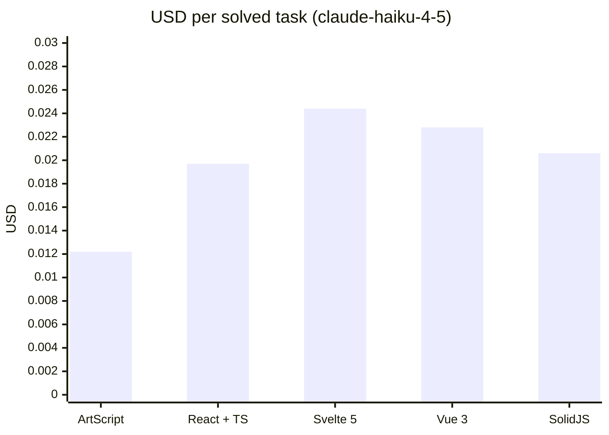
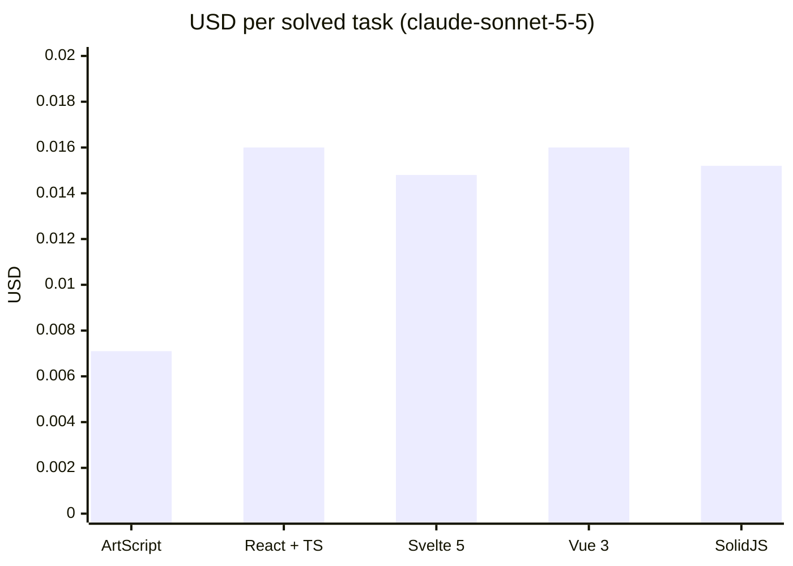
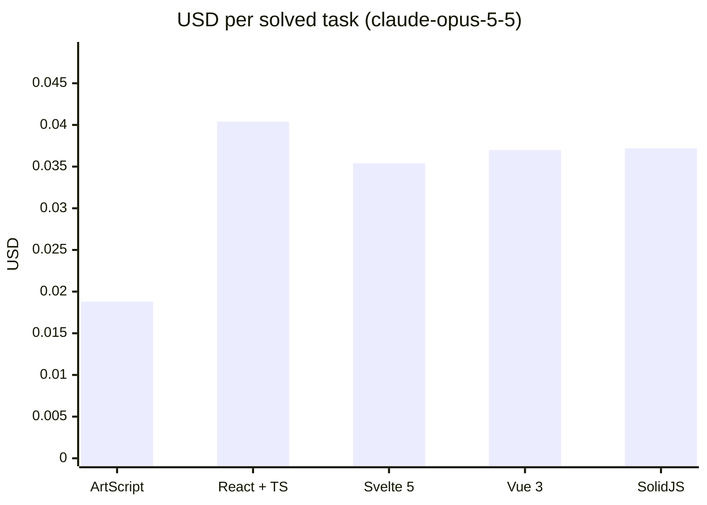

# ArtScript

An AI-native web language that compiles to JavaScript. Goal: let an AI build and modify web apps for **less money** (fewer tokens, less context, fewer retries) than with React/TypeScript.

```
page Counter "/" {
  state count = 0
  computed double = count * 2

  row gap=2 {
    button "-" -> count--
    text count bold
    button "+" primary -> count++
  }
  text `Double is ${double}` muted
}
```

Status: **v0.1, MVP foundation**.

**Measured result (2026-10-02):** Claude built and modified the same 50 tasks (small apps, full-stack apps, and changes to projects of 11, 42 and 102 components) in ArtScript, React + TypeScript, Svelte 5, Vue 3 and SolidJS, twice per task; every app was run and used in a simulated browser to check it works. Per working result, counting the spec, retries and thinking tokens, ArtScript cost **50% less than React with Claude Sonnet 5.5, 45% less with Opus 5.5 and 40% less with Haiku 4.5**, and less than every other stack with the three models. Sonnet and Opus solved 100/100 in ArtScript; Haiku solved 90/100 (86–89 in the other stacks), after three rounds of compiler fixes that its first runs (76/100, then 80/100) led to. The apps ship about 5–7 KB of JavaScript (brotli) versus ~59 KB for React, ~20 KB for Svelte, ~24 KB for Vue and ~6 KB for Solid. See [Cost eval results](#cost-eval-results) for the tables, the raw data and the method.

## Usage

Requires Node 24+.

```sh
npm install
npm run dev            # todo example at http://localhost:3000 (reloads on save)
npm run dev:counter    # counter example
npm run art -- dev examples/users   # full-stack CRUD example (api + data)
npm run art -- dev examples/notes   # accounts, private data and a server fn
npm run art -- dev examples/catalog # admin role, search, sort and pagination
npm test               # tests
npm run typecheck      # compiler types
npm run bench          # tokens and bytes vs React/Svelte
```

Create a new project (it comes with `npm run dev`, `npm run build` and `npm run check`):

```sh
npm create artscript@latest my-app
cd my-app && npm install && npm run dev
```

(`--template todo|blog|users|notes|catalog|crm` starts from a working app. From a clone of this repository: `node src/cli.ts init my-app`.)

A full-stack CRUD needs one line of backend. `api users: User` serves `/api/users` (list, get, create, update, remove), validated against the model and stored as JSON; `data` loads it and reloads by itself after every write:

```
model User {
  id: ID
  name: String
  email: Email
}

api users: User

page Users {
  data users = api.users.list()
  state name = ""

  input name
  button "Add" -> api.users.create({ name, email: "a@b.co" })
  for u in users {
    text u.name
    button "x" -> api.users.remove(u.id)
  }
}
```

The client is typed end to end: `create` is checked against the model at compile time. `art dev` serves the api; Sign-in with Google or GitHub: `auth users with google, github` and `ART_GOOGLE_ID`/`ART_GOOGLE_SECRET` (or `ART_GITHUB_*`). Emails (password reset, email verification, `email()` in server fns) go through Resend (`ART_RESEND_KEY`) or any JSON webhook (`ART_EMAIL_WEBHOOK`); in development they're printed and saved to `outbox.jsonl`. `art build` also emits `dist/server.js`, a single self-contained file (`node dist/server.js`, no `node_modules`), and a `Dockerfile` (data on a volume, health check at `/api/_health`, `ART_LOG=json` for one JSON log line per request). See [docs/DEPLOY.md](docs/DEPLOY.md) for static hosts, Node, Docker, Fly.io, Railway, Render and HTTPS proxies.

Accounts, per-user data and server logic are one line each:

```
api notes: Note private     // each user only sees and edits their own notes (owner is filled in)
auth users                  // auth.signup / login / logout / me: scrypt-hashed passwords, cookie sessions

server fn stats() {         // runs on the server, called as server.stats()
  if !me {
    fail("Log in first", 401)
  }
  let mine = db.notes.list().filter(n => n.owner == me.id)
  return { total: mine.length }
}
```

Passwords are never returned, and the accounts api only lets each user change or delete their own account. `api products: Product admin` lets anyone read and only admins write; the first account becomes the admin and nobody can give themselves a role.

Data lives in SQLite (built into Node, no dependencies), with typed queries:

```
data products = api.products.list({ search, sort: "-price", limit: 20, offset: page * 20 })
data total = api.products.count({ search })
```

Pages have real routes, layouts and client-side navigation (History API):

```
layout Main {
  link "Home" to="/"
  slot
}

page Product "/products/:id" {
  data product = api.products.get(params.id)   // params.id is typed from the route
}

page NotFound "*" {
  title "Not found"
}
```

The UI covers forms and data views out of the box (`select`, `radio`, `tabs`, `checkbox`, `textarea`, `file`, `modal`, `table`, `list`, `badge`, `spinner`, `video`…), plus `on:<event>` handlers, `ref` + `mount`/`effect` with `cleanup` for DOM libraries, component children through `slot`, keyed lists that keep their DOM (`for p in products key p.id`) and responsive props (`grid cols=1 md:cols=3`).

Any npm package or JS/TS module of your own can be used with `use`; the compiler checks that the module and every imported name exist, and `art build` bundles everything into one minified file:

```
use "date-fns" { format }
use "./lib/money.ts" { toUSD }
```

To change existing code, an AI can send a small `art patch` instead of rewriting files; the whole patch is typechecked and applied atomically:

```
replace Todos/column/title
  title "My tasks"
insert after Todos/column/row
  text "Type and press Enter" muted
set Todos/column gap=6
```

`art context <Component>` lists every addressable path. An agent that only changes existing code can load [docs/SPEC-EDIT.md](docs/SPEC-EDIT.md) (~800 tokens) instead of the full [spec](docs/SPEC.md) (~2.9K): the code it reads already shows the syntax.

Agents can use ArtScript's tools directly through MCP (`art_spec`, `art_check`, `art_context`, `art_patch`). In Claude Code:

```
claude mcp add artscript -- npx art mcp
```

The website, [leb90.github.io/ArtScript](https://leb90.github.io/ArtScript/), is itself an ArtScript app ([website/](website)): guides, the spec, the benchmarks, a playground with the compiler running in the browser, and `llms.txt` plus every page as Markdown for AI agents. `npm run site` builds it into `site/`.

Official components as source you can change (like shadcn/ui): `art add DataTable Pagination ConfirmButton SearchBox Stat EmptyState`.

Editors: `art lsp` is a language server (live errors with the compiler's fixes, formatting, completion) for any editor with LSP; [editors/vscode](editors/vscode) is a VS Code extension with highlighting that uses it, and [editors/tree-sitter-artscript](editors/tree-sitter-artscript) is a tree-sitter grammar (highlighting in Zed, Neovim and Helix). In `art dev`, Alt+A opens the dev tools: mounted components with their states, live.

Other commands: `npm run art -- <command>` (for example `npm run art -- check examples/todo --ai`). Full list: `npm run art -- help`.

On npm: [`@artscript/core`](https://www.npmjs.com/package/@artscript/core) (the compiler and the `art` command) and `create-artscript` (see [docs/PUBLISHING.md](docs/PUBLISHING.md)).

## Layout

```
src/
  lexer.ts      source → tokens
  parser.ts     tokens → AST (Pratt parser for JS expressions)
  ast.ts        AST types (stable, JSON-serializable)
  checker.ts    types, null safety, errors with fixes
  codegen.ts    AST → ES module that builds the DOM directly (no virtual DOM)
  printer.ts    AST → canonical code (fmt, errors, context)
  context.ts    compact context for LLMs
  patch.ts      `art patch`: structured AST edits, atomic and typechecked
  elements.ts   single table of UI primitives
  errors.ts     error catalog and human / AI output formats
  compile.ts    full pipeline
  cli.ts        the `art` command
runtime/runtime.js   signals + DOM helpers + api client (~2.9 KB brotli)
runtime/server.js    api server: REST from models, validation, SQLite storage, queries, auth, roles, server fns
examples/            counter, todo, users (full-stack CRUD), notes (auth + private data), catalog (roles, queries), blog (routes, layout), crm (relations, uploads, live data, modal)
benchmarks/          equivalent tasks in ArtScript / React / Svelte + measurement
docs/SPEC.md         compact spec to give an AI (~1.1K tokens)
templates/default/   starter project created by `art init`
tests/               parser, checker, runtime, e2e (in-memory DOM), tools, docs
```

## First measurements

`npm run bench`, `o200k_base` tokenizer:

| Task | ArtScript | React+TS | Svelte 5 |
|---|---|---|---|
| counter | 92 | 181 | 154 |
| todo | 245 | 471 | 400 |

This only measures **source code size**. It doesn't yet include the spec in context, agent iterations or USD cost, so no real savings can be claimed from it (that's what the agent cost eval below is for). Also, `o200k_base` is OpenAI's tokenizer; Claude's differs.

## Agent cost eval

`benchmarks/eval/` has Claude solve the same 8 tasks (6 create, 2 modify) in ArtScript, React+TS and Svelte, and measures what matters: **USD per solved task**. It counts the spec in context, retries until the code compiles, and thinking tokens.

```sh
npm run eval -- --dry-run                         # validates the harness, spends nothing
echo "ANTHROPIC_API_KEY=sk-ant-..." > .env        # .env is gitignored
npm run eval -- --runs 3 --max-usd 10             # full run (claude-opus-5-5)
npm run eval -- --model claude-sonnet-5-5 --tasks counter,todo
```

Validation: ArtScript with its own compiler, React with strict `tsc`, Svelte with its compiler (no type checking, which favors Svelte). It doesn't check runtime behavior yet, only that the code compiles and typechecks. Results are saved to `benchmarks/eval/results/`.

<!-- eval-results:start -->

## Cost eval results

All tasks, USD per solved task (solved runs / runs):

| Model | **ArtScript** | React + TS | Svelte 5 | Vue 3 | SolidJS | ArtScript vs React |
|---|---|---|---|---|---|---|
| claude-haiku-4-5 | **$0.0088** (90/100) | $0.0147 (86/100) | $0.0156 (89/100) | $0.0154 (88/100) | $0.0157 (87/100) | **−40%** |
| claude-sonnet-5-5 | **$0.0088** (100/100) | $0.0178 (100/100) | $0.0164 (100/100) | $0.0173 (100/100) | $0.0182 (100/100) | **−50%** |
| claude-opus-5-5 | **$0.0220** (100/100) | $0.0397 (99/99) | $0.0363 (100/100) | $0.0377 (100/100) | $0.0395 (100/100) | **−45%** |

### claude-haiku-4-5 (no effort setting)

With `claude-haiku-4-5`, ArtScript cost **38% less** per solved task than React + TS and **50% less** than Svelte 5.

| Stack | Solved | USD per solved task | vs React | Without prompt cache | Avg attempts | Output tokens / run | Final code tokens | App JS (brotli) |
|---|---|---|---|---|---|---|---|---|
| **ArtScript** | 43/52 | **$0.0122** | −38% | $0.0122 | 1.60 | 743 | 365 | 5.2 KB |
| React + TS | 42/52 | $0.0197 | — | $0.0197 | 1.60 | 2750 | 1535 | 58.8 KB |
| Svelte 5 | 41/52 | $0.0244 | +24% | $0.0244 | 1.79 | 3267 | 1544 | 18.4 KB |
| Vue 3 | 41/52 | $0.0228 | +16% | $0.0228 | 1.69 | 3096 | 1554 | 23.7 KB |
| SolidJS | 42/52 | $0.0206 | +4% | $0.0206 | 1.69 | 2858 | 1489 | 5.6 KB |



<details><summary>Per task</summary>

| Task | ArtScript | React + TS | Svelte 5 | Vue 3 | SolidJS |
|---|---|---|---|---|---|
| counter | $0.0045 (2/2) | $0.0022 (2/2) | $0.0041 (2/2) | $0.0029 (2/2) | $0.0039 (2/2) |
| todo | ✗ (0/2) | ✗ (0/2) | ✗ (0/2) | ✗ (0/2) | ✗ (0/2) |
| login | $0.0047 (2/2) | $0.0054 (2/2) | $0.0098 (2/2) | $0.0145 (2/2) | $0.0059 (2/2) |
| search | $0.0053 (2/2) | $0.0043 (2/2) | $0.0043 (2/2) | $0.0047 (2/2) | $0.0046 (2/2) |
| cart | ✗ (0/2) | $0.0132 (2/2) | $0.0636 (1/2) | $0.0091 (2/2) | $0.0211 (2/2) |
| tabs | $0.0053 (2/2) | $0.0033 (2/2) | $0.0114 (2/2) | $0.0041 (2/2) | $0.0033 (2/2) |
| counter-mod | $0.0025 (2/2) | $0.0020 (2/2) | $0.0019 (2/2) | $0.0021 (2/2) | $0.0023 (2/2) |
| todo-mod | $0.0030 (2/2) | $0.0041 (2/2) | $0.0025 (2/2) | $0.0033 (2/2) | $0.0032 (2/2) |
| fs-users | $0.0060 (2/2) | $0.0278 (2/2) | $0.0136 (2/2) | $0.0248 (2/2) | $0.0115 (2/2) |
| fs-shopping | $0.0062 (2/2) | $0.0446 (2/2) | $0.0780 (1/2) | $0.0206 (2/2) | $0.0209 (2/2) |
| fs-blog | $0.0413 (1/2) | $0.0878 (1/2) | ✗ (0/2) | ✗ (0/2) | ✗ (0/2) |
| fs-products | ✗ (0/2) | ✗ (0/2) | $0.0110 (2/2) | $0.0108 (2/2) | $0.0108 (2/2) |
| fs-avatar | $0.0081 (2/2) | $0.0652 (1/2) | $0.0512 (1/2) | $0.0645 (1/2) | $0.0251 (2/2) |
| routes | $0.0066 (2/2) | ✗ (0/2) | $0.0185 (2/2) | ✗ (0/2) | $0.0450 (1/2) |
| contacts | $0.0058 (2/2) | $0.0063 (2/2) | $0.0144 (2/2) | $0.0058 (2/2) | $0.0381 (1/2) |
| pagination | $0.0053 (2/2) | $0.0039 (2/2) | $0.0070 (2/2) | $0.0042 (2/2) | $0.0040 (2/2) |
| sort-table | $0.0059 (2/2) | $0.0059 (2/2) | $0.0052 (2/2) | $0.0046 (2/2) | $0.0061 (2/2) |
| stopwatch | $0.0051 (2/2) | $0.0083 (2/2) | $0.0030 (2/2) | $0.0057 (2/2) | $0.0033 (2/2) |
| nav-layout | $0.0107 (2/2) | $0.0515 (1/2) | ✗ (0/2) | ✗ (0/2) | ✗ (0/2) |
| query-search | $0.0050 (2/2) | $0.0042 (2/2) | $0.0239 (1/2) | $0.0377 (1/2) | $0.0168 (2/2) |
| wizard | $0.0063 (2/2) | $0.0084 (2/2) | $0.0254 (2/2) | $0.0091 (2/2) | $0.0188 (2/2) |
| inline-edit | $0.0058 (2/2) | $0.0051 (2/2) | $0.0048 (2/2) | $0.0118 (2/2) | $0.0057 (2/2) |
| fs-tasks | $0.0109 (2/2) | $0.0178 (2/2) | $0.0813 (1/2) | $0.0200 (2/2) | $0.0271 (2/2) |
| fs-votes | $0.0129 (2/2) | $0.0621 (1/2) | $0.0333 (2/2) | $0.0249 (2/2) | $0.0573 (1/2) |
| fs-catalog | ✗ (0/2) | $0.0109 (2/2) | $0.0109 (2/2) | $0.0705 (1/2) | $0.0517 (1/2) |
| fs-notes | $0.0256 (2/2) | $0.0214 (2/2) | $0.0538 (2/2) | $0.0349 (2/2) | $0.0262 (2/2) |

</details>

#### Larger project: 4 modifications to an 11-component shop

Whole project in the prompt ("full") vs. what a good agent would read ("focus": ArtScript gets `art context` of the relevant parts, React/Svelte the file list plus the relevant files). Each change is applied to the whole project and the app is used in the simulated browser.

| Stack | USD per solved task, full | USD per solved task, focus | Input tokens/run, full | Input tokens/run, focus | App JS (brotli) |
|---|---|---|---|---|---|
| **ArtScript** | $0.0051 (7/8) | $0.0023 (8/8) | 3233 | 1607 | 6.2 KB |
| React + TS | $0.0104 (6/8) | $0.0095 (6/8) | 3887 | 1971 | 59.1 KB |
| Svelte 5 | $0.0050 (8/8) | $0.0042 (8/8) | 2504 | 1092 | 20.4 KB |
| Vue 3 | $0.0048 (8/8) | $0.0038 (8/8) | 2266 | 833 | 24.7 KB |
| SolidJS | $0.0128 (6/8) | $0.0081 (7/8) | 4807 | 1819 | 6.3 KB |

Input tokens include ArtScript's spec in the system prompt (~1.9K tokens in the 2026-09-30 runs, ~2.7K from 2026-10-01 17:00 on, after routes and the 0.3 UI; mostly billed at the cache rate) and every retry.

#### Larger project: 4 modifications to a 42-component admin panel

Whole project in the prompt ("full") vs. what a good agent would read ("focus": ArtScript gets `art context` of the relevant parts, React/Svelte the file list plus the relevant files). Each change is applied to the whole project and the app is used in the simulated browser.

| Stack | USD per solved task, full | USD per solved task, focus | Input tokens/run, full | Input tokens/run, focus | App JS (brotli) |
|---|---|---|---|---|---|
| **ArtScript** | $0.0070 (8/8) | $0.0025 (8/8) | 6153 | 1984 | 6.4 KB |
| React + TS | $0.0104 (8/8) | $0.0043 (8/8) | 7622 | 1042 | 59.6 KB |
| Svelte 5 | $0.0099 (8/8) | $0.0044 (8/8) | 7246 | 1091 | 20.3 KB |
| Vue 3 | $0.0113 (8/8) | $0.0069 (7/8) | 7506 | 1707 | 24.8 KB |
| SolidJS | $0.0121 (8/8) | $0.0051 (8/8) | 8201 | 1089 | 6.8 KB |

Input tokens include ArtScript's spec in the system prompt (~1.9K tokens in the 2026-09-30 runs, ~2.7K from 2026-10-01 17:00 on, after routes and the 0.3 UI; mostly billed at the cache rate) and every retry.

#### Larger project: 4 modifications to a 102-component admin panel

Whole project in the prompt ("full") vs. what a good agent would read ("focus": ArtScript gets `art context` of the relevant parts, React/Svelte the file list plus the relevant files). Each change is applied to the whole project and the app is used in the simulated browser.

| Stack | USD per solved task, full | USD per solved task, focus | Input tokens/run, full | Input tokens/run, focus | App JS (brotli) |
|---|---|---|---|---|---|
| **ArtScript** | $0.0139 (8/8) | $0.0031 (8/8) | 13227 | 2527 | 7.3 KB |
| React + TS | $0.0207 (8/8) | $0.0049 (8/8) | 18176 | 1460 | 60.9 KB |
| Svelte 5 | $0.0199 (8/8) | $0.0050 (8/8) | 17202 | 1569 | 21.4 KB |
| Vue 3 | $0.0215 (8/8) | $0.0054 (8/8) | 17822 | 1475 | 26.0 KB |
| SolidJS | $0.0236 (8/8) | $0.0054 (8/8) | 19550 | 1507 | 7.8 KB |

Input tokens include ArtScript's spec in the system prompt (~1.9K tokens in the 2026-09-30 runs, ~2.7K from 2026-10-01 17:00 on, after routes and the 0.3 UI; mostly billed at the cache rate) and every retry.

Run 2026-10-02: 26 tasks × 5 stacks × 2 runs, total $4.15, prices as of 2026-09-25. 2026-10-02T16-45-31-claude-haiku-4-5.json: 50 tasks × 5 stacks × 2 runs; ArtScript solved 76/100 here at $0.0125 per solved task (15% less than React); 50 cell(s) re-run in 2026-10-02T17-35-30-claude-haiku-4-5.json (ArtScript only, after three rounds of compiler fixes from what Haiku wrote (commits bec073d, e257d73, 49a1dc4); a run between them, 2026-10-02T17-10-22, solved 80/100 at $0.0116. The other stacks are unchanged). Raw data: [`benchmarks/eval/results/2026-10-02T16-45-31-claude-haiku-4-5.json`](benchmarks/eval/results/2026-10-02T16-45-31-claude-haiku-4-5.json), [`benchmarks/eval/results/2026-10-02T17-35-30-claude-haiku-4-5.json`](benchmarks/eval/results/2026-10-02T17-35-30-claude-haiku-4-5.json).

### claude-sonnet-5-5 (effort medium)

With `claude-sonnet-5-5`, ArtScript cost **56% less** per solved task than React + TS and **52% less** than Svelte 5.

| Stack | Solved | USD per solved task | vs React | Without prompt cache | Avg attempts | Output tokens / run | Final code tokens | App JS (brotli) |
|---|---|---|---|---|---|---|---|---|
| **ArtScript** | 52/52 | **$0.0071** | −56% | $0.0148 | 1.06 | 517 | 412 | 5.2 KB |
| React + TS | 52/52 | $0.0160 | — | $0.0160 | 1.00 | 1516 | 1496 | 58.7 KB |
| Svelte 5 | 52/52 | $0.0148 | −7% | $0.0148 | 1.00 | 1397 | 1363 | 18.3 KB |
| Vue 3 | 52/52 | $0.0160 | +0% | $0.0160 | 1.04 | 1500 | 1395 | 23.6 KB |
| SolidJS | 52/52 | $0.0152 | −5% | $0.0152 | 1.00 | 1431 | 1415 | 5.6 KB |



<details><summary>Per task</summary>

| Task | ArtScript | React + TS | Svelte 5 | Vue 3 | SolidJS |
|---|---|---|---|---|---|
| counter | $0.0130 (2/2) | $0.0056 (2/2) | $0.0044 (2/2) | $0.0052 (2/2) | $0.0052 (2/2) |
| todo | $0.0056 (2/2) | $0.0129 (2/2) | $0.0114 (2/2) | $0.0125 (2/2) | $0.0129 (2/2) |
| login | $0.0037 (2/2) | $0.0096 (2/2) | $0.0096 (2/2) | $0.0092 (2/2) | $0.0096 (2/2) |
| search | $0.0072 (2/2) | $0.0094 (2/2) | $0.0085 (2/2) | $0.0099 (2/2) | $0.0097 (2/2) |
| cart | $0.0086 (2/2) | $0.0152 (2/2) | $0.0172 (2/2) | $0.0189 (2/2) | $0.0160 (2/2) |
| tabs | $0.0045 (2/2) | $0.0100 (2/2) | $0.0096 (2/2) | $0.0080 (2/2) | $0.0081 (2/2) |
| counter-mod | $0.0044 (2/2) | $0.0077 (2/2) | $0.0050 (2/2) | $0.0056 (2/2) | $0.0064 (2/2) |
| todo-mod | $0.0061 (2/2) | $0.0123 (2/2) | $0.0050 (2/2) | $0.0076 (2/2) | $0.0063 (2/2) |
| fs-users | $0.0054 (2/2) | $0.0239 (2/2) | $0.0216 (2/2) | $0.0205 (2/2) | $0.0209 (2/2) |
| fs-shopping | $0.0052 (2/2) | $0.0264 (2/2) | $0.0243 (2/2) | $0.0233 (2/2) | $0.0238 (2/2) |
| fs-blog | $0.0141 (2/2) | $0.0299 (2/2) | $0.0272 (2/2) | $0.0265 (2/2) | $0.0298 (2/2) |
| fs-products | $0.0101 (2/2) | $0.0188 (2/2) | $0.0186 (2/2) | $0.0159 (2/2) | $0.0192 (2/2) |
| fs-avatar | $0.0050 (2/2) | $0.0224 (2/2) | $0.0222 (2/2) | $0.0201 (2/2) | $0.0204 (2/2) |
| routes | $0.0047 (2/2) | $0.0111 (2/2) | $0.0132 (2/2) | $0.0140 (2/2) | $0.0118 (2/2) |
| contacts | $0.0053 (2/2) | $0.0148 (2/2) | $0.0118 (2/2) | $0.0129 (2/2) | $0.0123 (2/2) |
| pagination | $0.0038 (2/2) | $0.0080 (2/2) | $0.0085 (2/2) | $0.0084 (2/2) | $0.0075 (2/2) |
| sort-table | $0.0059 (2/2) | $0.0117 (2/2) | $0.0101 (2/2) | $0.0103 (2/2) | $0.0112 (2/2) |
| stopwatch | $0.0039 (2/2) | $0.0076 (2/2) | $0.0077 (2/2) | $0.0065 (2/2) | $0.0066 (2/2) |
| nav-layout | $0.0042 (2/2) | $0.0188 (2/2) | $0.0205 (2/2) | $0.0438 (2/2) | $0.0203 (2/2) |
| query-search | $0.0042 (2/2) | $0.0094 (2/2) | $0.0094 (2/2) | $0.0123 (2/2) | $0.0089 (2/2) |
| wizard | $0.0065 (2/2) | $0.0145 (2/2) | $0.0115 (2/2) | $0.0121 (2/2) | $0.0135 (2/2) |
| inline-edit | $0.0115 (2/2) | $0.0119 (2/2) | $0.0089 (2/2) | $0.0112 (2/2) | $0.0118 (2/2) |
| fs-tasks | $0.0078 (2/2) | $0.0250 (2/2) | $0.0255 (2/2) | $0.0244 (2/2) | $0.0266 (2/2) |
| fs-votes | $0.0066 (2/2) | $0.0216 (2/2) | $0.0235 (2/2) | $0.0193 (2/2) | $0.0200 (2/2) |
| fs-catalog | $0.0122 (2/2) | $0.0233 (2/2) | $0.0177 (2/2) | $0.0228 (2/2) | $0.0199 (2/2) |
| fs-notes | $0.0138 (2/2) | $0.0339 (2/2) | $0.0325 (2/2) | $0.0359 (2/2) | $0.0365 (2/2) |

</details>

#### Larger project: 4 modifications to an 11-component shop

Whole project in the prompt ("full") vs. what a good agent would read ("focus": ArtScript gets `art context` of the relevant parts, React/Svelte the file list plus the relevant files). Each change is applied to the whole project and the app is used in the simulated browser.

| Stack | USD per solved task, full | USD per solved task, focus | Input tokens/run, full | Input tokens/run, focus | App JS (brotli) |
|---|---|---|---|---|---|
| **ArtScript** | $0.0060 (8/8) | $0.0048 (8/8) | 2811 | 2059 | 6.1 KB |
| React + TS | $0.0129 (8/8) | $0.0104 (8/8) | 2784 | 1084 | 59.2 KB |
| Svelte 5 | $0.0126 (8/8) | $0.0090 (8/8) | 2731 | 1086 | 20.4 KB |
| Vue 3 | $0.0118 (8/8) | $0.0095 (8/8) | 2879 | 1109 | 24.8 KB |
| SolidJS | $0.0191 (8/8) | $0.0099 (8/8) | 4172 | 1132 | 6.4 KB |

Input tokens include ArtScript's spec in the system prompt (~1.9K tokens in the 2026-09-30 runs, ~2.7K from 2026-10-01 17:00 on, after routes and the 0.3 UI; mostly billed at the cache rate) and every retry.

#### Larger project: 4 modifications to a 42-component admin panel

Whole project in the prompt ("full") vs. what a good agent would read ("focus": ArtScript gets `art context` of the relevant parts, React/Svelte the file list plus the relevant files). Each change is applied to the whole project and the app is used in the simulated browser.

| Stack | USD per solved task, full | USD per solved task, focus | Input tokens/run, full | Input tokens/run, focus | App JS (brotli) |
|---|---|---|---|---|---|
| **ArtScript** | $0.0128 (8/8) | $0.0052 (8/8) | 6680 | 2255 | 6.3 KB |
| React + TS | $0.0245 (8/8) | $0.0100 (8/8) | 9534 | 1668 | 59.6 KB |
| Svelte 5 | $0.0228 (8/8) | $0.0081 (8/8) | 8898 | 1421 | 20.3 KB |
| Vue 3 | $0.0238 (8/8) | $0.0083 (8/8) | 9330 | 1405 | 24.8 KB |
| SolidJS | $0.0264 (8/8) | $0.0090 (8/8) | 10254 | 1486 | 6.8 KB |

Input tokens include ArtScript's spec in the system prompt (~1.9K tokens in the 2026-09-30 runs, ~2.7K from 2026-10-01 17:00 on, after routes and the 0.3 UI; mostly billed at the cache rate) and every retry.

#### Larger project: 4 modifications to a 102-component admin panel

Whole project in the prompt ("full") vs. what a good agent would read ("focus": ArtScript gets `art context` of the relevant parts, React/Svelte the file list plus the relevant files). Each change is applied to the whole project and the app is used in the simulated browser.

| Stack | USD per solved task, full | USD per solved task, focus | Input tokens/run, full | Input tokens/run, focus | App JS (brotli) |
|---|---|---|---|---|---|
| **ArtScript** | $0.0288 (8/8) | $0.0070 (8/8) | 14374 | 2932 | 7.3 KB |
| React + TS | $0.0505 (8/8) | $0.0097 (8/8) | 22654 | 2110 | 60.9 KB |
| Svelte 5 | $0.0468 (8/8) | $0.0094 (8/8) | 21052 | 2102 | 21.3 KB |
| Vue 3 | $0.0493 (8/8) | $0.0096 (8/8) | 22084 | 2026 | 26.0 KB |
| SolidJS | $0.0547 (8/8) | $0.0103 (8/8) | 24364 | 2167 | 7.8 KB |

Input tokens include ArtScript's spec in the system prompt (~1.9K tokens in the 2026-09-30 runs, ~2.7K from 2026-10-01 17:00 on, after routes and the 0.3 UI; mostly billed at the cache rate) and every retry.

Run 2026-10-02: 26 tasks × 5 stacks × 2 runs, total $3.59, prices as of 2026-09-25. 2026-10-02T17-07-31-claude-sonnet-5-5.json: 50 tasks × 5 stacks × 2 runs, ArtScript at commit e257d73. Raw data: [`benchmarks/eval/results/2026-10-02T17-07-31-claude-sonnet-5-5.json`](benchmarks/eval/results/2026-10-02T17-07-31-claude-sonnet-5-5.json).

### claude-opus-5-5 (effort medium)

With `claude-opus-5-5`, ArtScript cost **53% less** per solved task than React + TS and **47% less** than Svelte 5.

| Stack | Solved | USD per solved task | vs React | Without prompt cache | Avg attempts | Output tokens / run | Final code tokens | App JS (brotli) |
|---|---|---|---|---|---|---|---|---|
| **ArtScript** | 52/52 | **$0.0188** | −53% | $0.0345 | 1.02 | 792 | 561 | 5.4 KB |
| React + TS | 51/51 | $0.0404 | — | $0.0404 | 1.04 | 1912 | 1689 | 58.8 KB |
| Svelte 5 | 52/52 | $0.0354 | −12% | $0.0354 | 1.02 | 1673 | 1467 | 18.5 KB |
| Vue 3 | 52/52 | $0.0370 | −8% | $0.0370 | 1.02 | 1754 | 1563 | 23.7 KB |
| SolidJS | 52/52 | $0.0372 | −8% | $0.0372 | 1.00 | 1771 | 1641 | 5.7 KB |



<details><summary>Per task</summary>

| Task | ArtScript | React + TS | Svelte 5 | Vue 3 | SolidJS |
|---|---|---|---|---|---|
| counter | $0.0282 (2/2) | $0.0126 (2/2) | $0.0128 (2/2) | $0.0131 (2/2) | $0.0118 (2/2) |
| todo | $0.0171 (2/2) | $0.0278 (2/2) | $0.0247 (2/2) | $0.0267 (2/2) | $0.0308 (2/2) |
| login | $0.0077 (2/2) | $0.0192 (2/2) | $0.0208 (2/2) | $0.0219 (2/2) | $0.0218 (2/2) |
| search | $0.0120 (2/2) | $0.0201 (2/2) | $0.0205 (2/2) | $0.0213 (2/2) | $0.0281 (2/2) |
| cart | $0.0292 (2/2) | $0.0383 (2/2) | $0.0404 (2/2) | $0.0410 (2/2) | $0.0352 (2/2) |
| tabs | $0.0112 (2/2) | $0.0265 (2/2) | $0.0246 (2/2) | $0.0240 (2/2) | $0.0206 (2/2) |
| counter-mod | $0.0096 (2/2) | $0.0175 (2/2) | $0.0107 (2/2) | $0.0113 (2/2) | $0.0141 (2/2) |
| todo-mod | $0.0085 (2/2) | $0.0253 (2/2) | $0.0114 (2/2) | $0.0101 (2/2) | $0.0109 (2/2) |
| fs-users | $0.0143 (2/2) | $0.0445 (2/2) | $0.0410 (2/2) | $0.0348 (2/2) | $0.0364 (2/2) |
| fs-shopping | $0.0132 (2/2) | $0.0544 (2/2) | $0.0516 (2/2) | $0.0561 (2/2) | $0.0569 (2/2) |
| fs-blog | $0.0283 (2/2) | $0.0671 (2/2) | $0.0569 (2/2) | $0.0614 (2/2) | $0.0745 (2/2) |
| fs-products | $0.0259 (2/2) | $0.0477 (2/2) | $0.0378 (2/2) | $0.0428 (2/2) | $0.0501 (2/2) |
| fs-avatar | $0.0211 (2/2) | $0.0588 (1/1) | $0.0505 (2/2) | $0.0540 (2/2) | $0.0575 (2/2) |
| routes | $0.0082 (2/2) | $0.0316 (2/2) | $0.0409 (2/2) | $0.0375 (2/2) | $0.0328 (2/2) |
| contacts | $0.0161 (2/2) | $0.0377 (2/2) | $0.0330 (2/2) | $0.0357 (2/2) | $0.0323 (2/2) |
| pagination | $0.0073 (2/2) | $0.0174 (2/2) | $0.0127 (2/2) | $0.0190 (2/2) | $0.0170 (2/2) |
| sort-table | $0.0130 (2/2) | $0.0262 (2/2) | $0.0191 (2/2) | $0.0220 (2/2) | $0.0266 (2/2) |
| stopwatch | $0.0097 (2/2) | $0.0191 (2/2) | $0.0183 (2/2) | $0.0129 (2/2) | $0.0155 (2/2) |
| nav-layout | $0.0168 (2/2) | $0.0423 (2/2) | $0.0475 (2/2) | $0.0502 (2/2) | $0.0415 (2/2) |
| query-search | $0.0169 (2/2) | $0.0251 (2/2) | $0.0223 (2/2) | $0.0233 (2/2) | $0.0265 (2/2) |
| wizard | $0.0175 (2/2) | $0.0366 (2/2) | $0.0311 (2/2) | $0.0352 (2/2) | $0.0341 (2/2) |
| inline-edit | $0.0209 (2/2) | $0.0256 (2/2) | $0.0234 (2/2) | $0.0270 (2/2) | $0.0276 (2/2) |
| fs-tasks | $0.0325 (2/2) | $0.0627 (2/2) | $0.0547 (2/2) | $0.0567 (2/2) | $0.0607 (2/2) |
| fs-votes | $0.0271 (2/2) | $0.1152 (2/2) | $0.0776 (2/2) | $0.0779 (2/2) | $0.0504 (2/2) |
| fs-catalog | $0.0464 (2/2) | $0.0581 (2/2) | $0.0464 (2/2) | $0.0540 (2/2) | $0.0519 (2/2) |
| fs-notes | $0.0298 (2/2) | $0.1019 (2/2) | $0.0895 (2/2) | $0.0932 (2/2) | $0.1014 (2/2) |

</details>

#### Larger project: 4 modifications to an 11-component shop

Whole project in the prompt ("full") vs. what a good agent would read ("focus": ArtScript gets `art context` of the relevant parts, React/Svelte the file list plus the relevant files). Each change is applied to the whole project and the app is used in the simulated browser.

| Stack | USD per solved task, full | USD per solved task, focus | Input tokens/run, full | Input tokens/run, focus | App JS (brotli) |
|---|---|---|---|---|---|
| **ArtScript** | $0.0167 (8/8) | $0.0108 (8/8) | 2811 | 2059 | 6.2 KB |
| React + TS | $0.0264 (8/8) | $0.0202 (8/8) | 2784 | 1084 | 59.1 KB |
| Svelte 5 | $0.0259 (8/8) | $0.0222 (8/8) | 2731 | 1425 | 20.4 KB |
| Vue 3 | $0.0280 (8/8) | $0.0177 (8/8) | 3378 | 1109 | 24.8 KB |
| SolidJS | $0.0268 (8/8) | $0.0201 (8/8) | 2873 | 1132 | 6.4 KB |

Input tokens include ArtScript's spec in the system prompt (~1.9K tokens in the 2026-09-30 runs, ~2.7K from 2026-10-01 17:00 on, after routes and the 0.3 UI; mostly billed at the cache rate) and every retry.

#### Larger project: 4 modifications to a 42-component admin panel

Whole project in the prompt ("full") vs. what a good agent would read ("focus": ArtScript gets `art context` of the relevant parts, React/Svelte the file list plus the relevant files). Each change is applied to the whole project and the app is used in the simulated browser.

| Stack | USD per solved task, full | USD per solved task, focus | Input tokens/run, full | Input tokens/run, focus | App JS (brotli) |
|---|---|---|---|---|---|
| **ArtScript** | $0.0310 (8/8) | $0.0119 (8/8) | 7566 | 2565 | 6.4 KB |
| React + TS | $0.0486 (8/8) | $0.0171 (8/8) | 9534 | 1429 | 59.6 KB |
| Svelte 5 | $0.0464 (8/8) | $0.0160 (8/8) | 8898 | 1421 | 20.3 KB |
| Vue 3 | $0.0481 (8/8) | $0.0171 (8/8) | 9330 | 1405 | 24.8 KB |
| SolidJS | $0.0536 (8/8) | $0.0194 (8/8) | 10254 | 1486 | 6.8 KB |

Input tokens include ArtScript's spec in the system prompt (~1.9K tokens in the 2026-09-30 runs, ~2.7K from 2026-10-01 17:00 on, after routes and the 0.3 UI; mostly billed at the cache rate) and every retry.

#### Larger project: 4 modifications to a 102-component admin panel

Whole project in the prompt ("full") vs. what a good agent would read ("focus": ArtScript gets `art context` of the relevant parts, React/Svelte the file list plus the relevant files). Each change is applied to the whole project and the app is used in the simulated browser.

| Stack | USD per solved task, full | USD per solved task, focus | Input tokens/run, full | Input tokens/run, focus | App JS (brotli) |
|---|---|---|---|---|---|
| **ArtScript** | $0.0681 (8/8) | $0.0142 (8/8) | 16235 | 2932 | 7.3 KB |
| React + TS | $0.1019 (8/8) | $0.0201 (8/8) | 22654 | 2110 | 60.9 KB |
| Svelte 5 | $0.0944 (8/8) | $0.0185 (8/8) | 21052 | 2102 | 21.4 KB |
| Vue 3 | $0.0998 (8/8) | $0.0193 (8/8) | 22084 | 2026 | 26.0 KB |
| SolidJS | $0.1102 (8/8) | $0.0214 (8/8) | 24364 | 2167 | 7.8 KB |

Input tokens include ArtScript's spec in the system prompt (~1.9K tokens in the 2026-09-30 runs, ~2.7K from 2026-10-01 17:00 on, after routes and the 0.3 UI; mostly billed at the cache rate) and every retry.

Run 2026-10-02: 26 tasks × 5 stacks × 2 runs, total $8.74, prices as of 2026-09-25. 2026-10-02T17-49-54-claude-opus-5-5.json: 50 tasks × 5 stacks × 2 runs; ArtScript's first run at commit e257d73, its second at 7f81b5e; one React run was a model refusal and is left out. Raw data: [`benchmarks/eval/results/2026-10-02T17-49-54-claude-opus-5-5.json`](benchmarks/eval/results/2026-10-02T17-49-54-claude-opus-5-5.json).

### Methodology and limitations

- **The 2026-10-02 measurement** (the numbers above): 50 tasks, three models, five stacks, two runs per task. Before it, a pilot ran ArtScript alone once per model (USD 2.34, files `2026-10-02T16-1*`); what the models tripped on was fixed in the compiler (accepting what they write, clearer errors, a `for` statement) and the measurement started from that version. Haiku then solved 76/100 ArtScript runs, against 86–89 in the other stacks; two more rounds of the same kind of fixes followed, and its ArtScript cells were run again each time (80/100, then 90/100, the one reported). React, Svelte, Vue and Solid ran once: their toolchains didn't change. Sonnet's and Opus's ArtScript cells ran once, between those rounds. Every answer of every run is in the raw data, and `--replay` re-checks them with the current compiler.
- Each task is the same functional request for every stack: small apps created from scratch (some full-stack), small modifications, and modifications to larger generated projects (11, 42 and 102 components). Claude gets the task, returns files, and the harness validates them: ArtScript with its compiler, React and SolidJS with strict `tsc`, Svelte and Vue with their compilers. Errors are fed back, up to 3 attempts.
- In modification tasks each stack may use its cheapest edit format: ArtScript an `art patch`, React and Svelte search/replace edit blocks (like a coding agent's Edit tool). Full files are also accepted. Runs before 2026-10-01 had no edit formats: every stack returned full files.
- Cost is computed from the real `usage` the API returns: the ArtScript spec in the system prompt, retries and thinking tokens (billed as output) all count.
- ArtScript's system prompt includes its spec (1.2K–3.2K tokens depending on the run date; 3.2K in the 2026-10-02 measurement), which is served from the prompt cache after the first request; the "without prompt cache" column prices those tokens at the full input rate.
- Since 2026-10-01 every app is also **run and used like a person would**: it's mounted in a simulated browser (happy-dom) and a stack-agnostic check clicks, types and reads the screen (e.g. adds and completes todos, reloads the page to check data persisted on the server). A failed check is fed back to Claude like a compiler error. Earlier runs only checked that code compiled and typechecked.
- Full-stack tasks: the other stacks also write their own `server.ts` (Node `http`, no dependencies, data in memory); ArtScript uses `api`, which also persists to SQLite. Svelte is validated without TypeScript type checking of `.svelte` files, which favors it.
- Since 2026-10-01 18:47, ArtScript modification tasks get docs/SPEC-EDIT.md (~800 tokens) instead of the full spec; creation tasks keep the full spec. Earlier runs sent the full spec everywhere.
- Each run uses the ArtScript spec as of its date (in English since 2026-10-02).
- A model refusal (Opus, on the photo-upload task: twice in React, once in Vue) is not a result: it is left out, and re-run when the run is resumed.
- Task prompts (and the feedback given to the model) are in Spanish; they are the fixed dataset these numbers were measured on.
- App JS: each working app bundled with esbuild (minified, production mode) and compressed with brotli: the JavaScript a browser downloads. ArtScript's includes its runtime; React's includes React DOM; Svelte's includes its client runtime.
- Two runs per task is a signal, not a definitive benchmark: the smaller the model, the more its results move between runs (Haiku's ArtScript cells went 76, 80, 90 out of 100 as the compiler improved, and part of that is noise). Reproduce it with `npm run eval`; `npm run eval -- --dry-run` checks the harness and every reference app offline, and `--replay <results.json>` re-checks stored answers with the current compiler.

<!-- eval-results:end -->

## License

MIT
